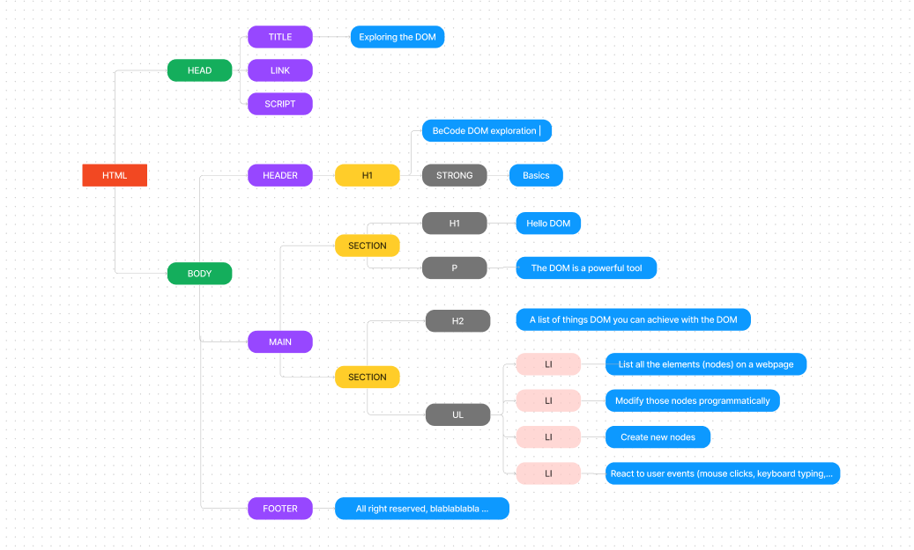

# DOM EXPLORATION

This is a repository created by me to show the results of DOM exploration exercise on BeCode Junior Web Dev bootcamp. Challenge completed in 07/11/2023.

You can check the guidelines for this exercise by [following this link to Verou-5 repository](https://github.com/becodeorg/GNT-Verou-5/tree/main/1.The-Field/11.DOM-exploration).

You can find the Projects results on the following links:

[Collections](https://scificollection.netlify.app/)  
[Ghost Kitchen](https://saudadebraziliankitchen.netlify.app/)  
[Calculator](https://eduarda-calculator.netlify.app/)

## CHAPTERS

### [1. INTRODUCTION](https://github.com/becodeorg/GNT-Verou-5/tree/main/1.The-Field/11.DOM-exploration/1.Introduction)

### [2. SELECTORS](https://github.com/becodeorg/GNT-Verou-5/tree/main/1.The-Field/11.DOM-exploration/2.Selectors)

#### ✏️ for loop
#### ✏️ forEach loop
#### ✏️ Math.random()

### [3. CREATE](https://github.com/becodeorg/GNT-Verou-5/tree/main/1.The-Field/11.DOM-exploration/3.Create)

#### ✏️ shuffle Array
#### ✏️ if conditional
#### ✏️ appendChild()

### [4. NAVIGATE](https://github.com/becodeorg/GNT-Verou-5/tree/main/1.The-Field/11.DOM-exploration/4.Navigate)

#### ✏️ insertBefore()
#### ✏️ children()

### [5. EVENTS](https://github.com/becodeorg/GNT-Verou-5/tree/main/1.The-Field/11.DOM-exploration/5.Events)

#### ✏️ addEventListener()
#### ✏️ keypress event
#### ✏️ alert()
#### ✏️ while loop
#### ✏️ remove()
 

### [6. FORMS](https://github.com/becodeorg/GNT-Verou-5/tree/main/1.The-Field/11.DOM-exploration/6.Forms)

#### ✏️ form validation
#### ✏️ functions
#### ✏️ e.target

### [7. DOM-DRILL](https://github.com/becodeorg/GNT-Verou-5/tree/main/1.The-Field/11.DOM-exploration/7.DOM-drill)

&nbsp;  

## PROJECTS

### [1. COLLECTION](https://github.com/becodeorg/GNT-Verou-5/tree/main/1.The-Field/11.DOM-exploration/Projects/1.Collection-project)

#### [TOP 10 SCI-FI BOOKS](https://scificollection.netlify.app/) 

#### 🌌  modular javascript
#### 🌌  objects

&nbsp;  

### [2. GHOST KITCHEN](https://github.com/becodeorg/GNT-Verou-5/tree/main/1.The-Field/11.DOM-exploration/Projects/2.Dark-kitchen-project)

#### [SAUDADE BRAZILIAN KITCHEN](https://saudadebraziliankitchen.netlify.app/)  

#### 🍴  parseFloat()
#### 🍴  setTimeout()  
#### 🍴  toggle (color mode)
#### 🍴  shopping cart
 
&nbsp;  

### [3. CALCULATOR](https://github.com/becodeorg/GNT-Verou-5/tree/main/1.The-Field/11.DOM-exploration/Projects/3.Calculator-project)

#### [EDUARDA'S CALCULATOR](https://eduarda-calculator.netlify.app/)

#### 🔬  data-attribute
#### 🔬  class {}
#### 🔬  constructor / this
#### 🔬  toString()
#### 🔬  concatenation
#### 🔬  preventDefault()  

&nbsp;  
&nbsp;  

